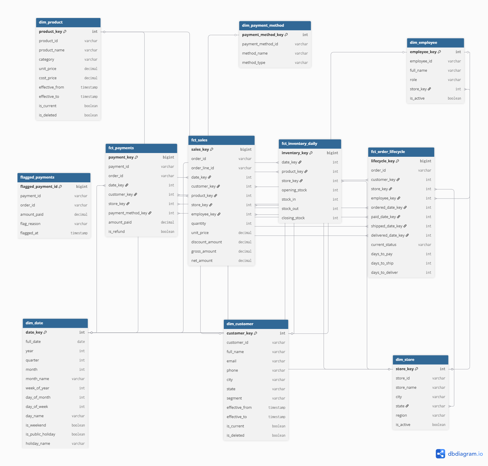
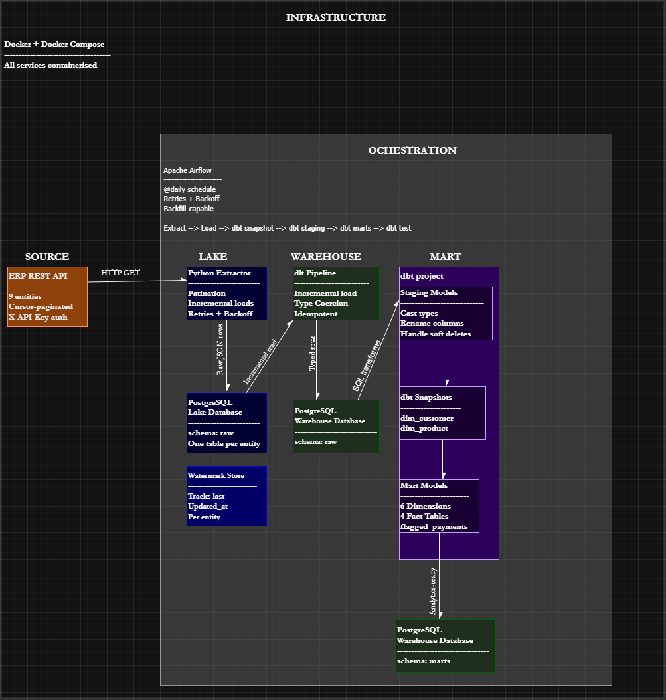

# RetailCo Data Pipeline

A modern end-to-end data pipeline for RetailCo, a Nigerian retail chain.
Built with Airflow, PostgreSQL, dbt, dlt, and Docker.

---

## Design Artifacts

### Kimball Bus Matrix

| | dim_date | dim_customer | dim_product | dim_store | dim_employee | dim_payment_method |
|---|:---:|:---:|:---:|:---:|:---:|:---:|
| **fct_sales** | ✓ | ✓ | ✓ | ✓ | ✓ | ✗ |
| **fct_payments** | ✓ | ✓ | ✗ | ✓ | ✗ | ✓ |
| **fct_inventory_daily** | ✓ | ✗ | ✓ | ✓ | ✗ | ✗ |
| **fct_order_lifecycle** | ✓*4 | ✓ | ✗ | ✓ | ✓ | ✗ |

> **\* fct_order_lifecycle** has four separate foreign keys to `dim_date`:
> `ordered_date_key`, `paid_date_key`, `shipped_date_key`, `delivered_date_key`

### Warehouse ERD

### Architecture Diagram

